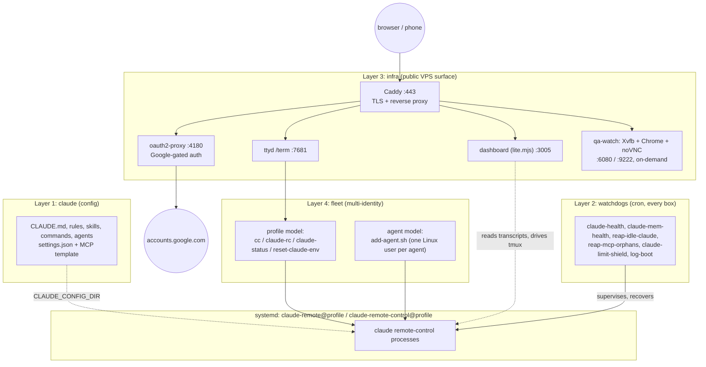

# mows-harness

A complete, self-hosted Claude Code harness: agentic config, unattended watchdogs, a
Google-gated web cockpit, and multi-identity fleet tooling. Four independent layers —
install only what you need, from a single laptop up to a public, phone-reachable VPS.

**This README is written to be executed by a Claude Code agent.** Point Claude at this repo
and say *"install this harness"*; everything it needs to do that autonomously — the decision
tree, the exact commands, what to verify after each one, and the short list of things it must
stop and ask you about — is below. A human reading it top-to-bottom gets the same
information in the same order.

---

# Part 1 — Agent brief

**You are installing this on the machine you are running on.** Read this whole part before
running anything.

## What you are installing

| Layer | Flag | What lands where | Reversible? |
|---|---|---|---|
| **claude** | `--claude` | `CLAUDE.md`, rules, 9 commands, 11 skills, 1 agent, `settings.json`, `mcp-interactive.json` → `~/.claude/` | Yes — prior files backed up to `~/.claude.bak-<ts>/` |
| **watchdogs** | `--watchdogs` | 6 scripts → `~/.local/bin/` (+ `~/bin/` for the limit shield). Cron block is **printed, never installed** | Yes |
| **infra** | `--infra` | Renders VPS templates into `./rendered/` **only**. Installs nothing, enables nothing, starts nothing | Yes — nothing leaves the repo dir |
| **fleet** | `--fleet` | `cc`, `claude-rc`, `claude-status`, `reset-claude-env` → `~/.local/bin/` | Yes |

All four are idempotent and independent. Re-running with a different flag set is safe.

## Decide which layers to install

Ask the human only if their intent is genuinely ambiguous — otherwise infer from the box:

- **Laptop / workstation, human drives Claude interactively** → `--claude`
- **Server the human checks in on remotely** → `--claude --watchdogs`
- **Multiple Claude accounts/identities on one box** → add `--fleet`
- **Public VPS with a dashboard and web terminal** → `--all`, then Part 3 (needs the human)

## Preconditions — check these first, in this order

```bash
command -v apt-get systemctl        # both required; install.sh refuses to run without them
node -v                             # want v20+; see Requirements below if older
command -v tmux || echo "MISSING: sudo apt-get install -y tmux"
command -v git curl                 # needed for clone + Node install
```

`install.sh` hard-guards on `apt-get` **and** `systemctl` being present. This is
Ubuntu/Debian + systemd only; on anything else, stop and tell the human rather than
improvising.

## Values you cannot invent

Only the `--infra` layer needs these. **Never fabricate, guess, or placeholder-fill a real
credential** — stop and ask the human:

| Value | Where the human gets it | Needed for |
|---|---|---|
| `DOMAIN` | their registrar; DNS `A` record must already point at this box | Caddy TLS, oauth2-proxy cookies |
| `OAUTH_CLIENT_ID` / `OAUTH_CLIENT_SECRET` | Google Cloud Console → APIs & Services → Credentials → OAuth client (Web application) | the auth gate |
| `ADMIN_EMAIL` | the Google account allowed to log in | oauth2-proxy allowlist |
| `CONTEXT7_API_KEY` | context7.com (optional — skip if they don't use it) | the `context7` MCP server |

You *may* generate `COOKIE_SECRET` yourself — `install.sh` does it automatically with
`openssl rand -base64 32` when it's unset. `ADMIN_USER` defaults to the invoking user.
`EXAMPLE_SUB` is any subdomain label (e.g. `alpha`) used as the template's worked example.

Pass values as environment variables to stay non-interactive:

```bash
DOMAIN=example.com ADMIN_EMAIL=you@example.com ./install.sh --infra --non-interactive
```

With `--non-interactive`, any value you don't supply is left as a literal `{{...}}` placeholder
in the rendered output and reported on a `WARN:` line. That is safe — nothing is installed —
but **never `sudo install` a rendered file that still contains a placeholder.**

## Rules — do not violate these autonomously

1. **Never enable or start an infra service without explicit human confirmation.** `--infra`
   only stages files into `./rendered/`. Installing them is Part 3, and it is the human's call.
2. **Never apply a firewall ruleset non-interactively.** `infra/os/firewall/*.template` can
   lock the human out of their own box. Use `iptables-apply` (auto-reverts without
   confirmation), never a blind `iptables-restore`.
3. **Never change DNS, create cloud resources, or register OAuth apps.** Those are the
   human's accounts.
4. **Never add `alias claude="claude --dangerously-skip-permissions"`.** See Security
   defaults. If the human asks for it, quote the warning first.
5. **Never run `caddy fmt --overwrite` on `infra/caddy/Caddyfile.template`** — it mangles the
   `{{...}}` placeholder braces.
6. **Never edit `~/.claude/settings.json` by hand after install** — re-run `install.sh
   --claude`, which backs the old one up first.
7. **Stop and report** if `./scripts/preflight.sh` fails, if a verification step below
   doesn't produce the expected output, or if you'd have to invent a credential to continue.

---

# Part 2 — Autonomous install

Everything here is safe for you to run without asking, once the human has said "install it".

## Step 1 — clone and self-check

```bash
git clone https://github.com/alhe99/mows-harness.git
cd mows-harness
./scripts/preflight.sh
```

Expect the last line to be `preflight: ALL CLEAN`. That gate checks manifest completeness,
scans for leaked secrets/identity, shellchecks every script, and runs a sandboxed install
dry-run. **If it fails, stop** — do not install from a repo that fails its own gate.

## Step 2 — install the layers you chose

```bash
./install.sh --claude                        # config only
./install.sh --claude --watchdogs            # + unattended supervision
./install.sh --claude --watchdogs --fleet    # + multi-identity CLIs
./install.sh --all                           # + infra staging (Part 3 follows)
./install.sh                                 # interactive picker (human at keyboard only)
```

Add `--non-interactive` when nobody is at the keyboard. Full flags: `./install.sh --help`.

## Step 3 — verify what you installed

Run the checks for the layers you actually installed. Each has an expected result; if one
doesn't match, report it rather than working around it.

```bash
# --claude
ls ~/.claude/CLAUDE.md ~/.claude/settings.json ~/.claude/mcp-interactive.json
ls ~/.claude/skills | wc -l            # expect 11
ls ~/.claude/commands | wc -l          # expect 9
python3 -m json.tool ~/.claude/settings.json > /dev/null && echo "settings.json OK"
grep -c '{{' ~/.claude/mcp-interactive.json    # expect 0; nonzero = an unfilled placeholder

# --watchdogs
ls ~/.local/bin/claude-health ~/.local/bin/claude-mem-health ~/bin/claude-limit-shield.sh
~/.local/bin/claude-health --once      # runs a single pass; expect exit 0

# --fleet
cc --help 2>&1 | head -1               # or: ~/.local/bin/cc --help
claude-rc help | head -1

# --infra
ls rendered/                           # staged templates; nothing installed yet
grep -rl '{{' rendered/ || echo "all placeholders resolved"
```

`~/.local/bin` must be on `PATH`. `install.sh --claude` offers to append it to `~/.bashrc`
(it asks first, and it never writes an alias).

## Step 4 — cron, if you installed watchdogs

`install.sh` **prints** the crontab block; it never edits crontab. Show the human the printed
block and let them paste it, or — if they've told you to handle cron — install it
additively, never destructively:

```bash
# additive: keeps every existing entry, appends ours
{ crontab -l 2>/dev/null; sed "s|\$HOME|$HOME|g" watchdogs/crontab.example | grep -v '^#'; } | crontab -
crontab -l | grep claude               # verify the 6 entries landed
```

Cron does not expand `$HOME` — that `sed` is required, not cosmetic.

## Step 5 — report back

Tell the human, concretely: which layers installed, the verification results, anything you
skipped and why, and — if they asked for infra — that Part 3 needs their credentials and
decisions before anything goes live.

---

# Part 3 — Infra: human-in-the-loop

`--infra` has staged `./rendered/` and stopped. Nothing is live. Going live needs decisions
and credentials only the human can supply, in this order (full walkthrough with exact
commands: [`infra/SETUP.md`](infra/SETUP.md)):

1. **DNS** — `A` records for the apex and each subdomain, pointed at this box. Must be in
   place *before* Caddy starts, or ACME HTTP-01 cert issuance fails.
2. **Packages** — Caddy, ttyd, and Node 20 from NodeSource. Mask the distro's own ttyd unit
   immediately (`sudo systemctl mask --now ttyd.service`) — it is unauthenticated; this
   harness runs ttyd only behind Caddy + oauth2-proxy.
3. **Google OAuth app** — consent screen + Web application client, redirect URI exactly
   `https://<domain>/oauth2/callback`.
4. **Review `./rendered/`** — read every file before it is installed with `sudo`. Confirm no
   `{{...}}` placeholder survives in anything root will execute.
5. **Install and enable, in order** — caddy → oauth2-proxy → dashboard → web terminal. The
   sudoers file goes in via `visudo -cf` validation, mode `0440`.
6. **`sudo loginctl enable-linger <user>`** — `claude-rc`'s ad-hoc listeners use user-scope
   systemd and will fail fast without it.
7. **Web terminal page** — run `infra/webconsole/make-term-index.sh` once. Without it, `/term`
   returns 404: ttyd's ~700KB generated index is deliberately not vendored here, so the
   script fetches it locally and splices in the clipboard shim.
8. **Verify** — `curl -sI https://<domain>` should redirect toward Google sign-in.

Optional, on demand: the browser-QA watch stack (`infra/qa-watch/SETUP.md`) needs
`xvfb fluxbox x11vnc websockify novnc xdotool` plus Chrome/Chromium. It ships **disabled** on
purpose — the `qa` skill starts and stops it.

---

# Part 4 — Reference

## Architecture



## What each layer contains

- **`claude/`** — the agentic config: `CLAUDE.md`, a context7 rule, 9 commands, 11
  agentic-dev/harness-ops skills, a PR-summary agent, plus `settings.json` and MCP templates.
  Also installable as a standalone plugin (below).
- **`watchdogs/`** — six cron scripts keeping a remote-control Claude Code process alive and
  clean: unit/wedge recovery, memory-capture verification, idle-session reaping, orphaned-MCP
  reaping, usage-limit auto-continue, boot logging.
- **`infra/`** — templates for the public surface: Caddy (TLS + reverse proxy), oauth2-proxy
  (Google-gated auth), a zero-dependency session dashboard, a `ttyd` web terminal, an
  on-demand browser-QA watch stack, firewall templates, and scoped sudoers.
- **`fleet/`** — several Claude identities on one box: named *profiles* under one account
  (`cc`, `claude-rc`, `claude-status`, `reset-claude-env`), or separate Linux-user *agent*
  accounts (`add-agent.sh`).

Deeper detail — port map, the profile-vs-agent model, watchdog rationale, known operational
caveats — is in [`docs/architecture.md`](docs/architecture.md). Attributions:
[`ATTRIBUTIONS.md`](ATTRIBUTIONS.md). Per-module guides: [`infra/SETUP.md`](infra/SETUP.md),
[`fleet/SETUP.md`](fleet/SETUP.md), [`watchdogs/SETUP.md`](watchdogs/SETUP.md),
[`infra/os/SETUP.md`](infra/os/SETUP.md), [`infra/qa-watch/SETUP.md`](infra/qa-watch/SETUP.md).

## The plugin route (skills/commands/agents only)

For just the commands, agents, and skills — no clone, no `install.sh` — run these inside a
Claude Code session:

```
/plugin marketplace add alhe99/mows-harness
/plugin install mows-core@mows-harness
```

This does **not** give you the global `~/.claude/CLAUDE.md`, the `settings.json`/MCP
templates, or the watchdogs/infra/fleet layers. For those, clone and run `install.sh`.

## Security defaults

**No `--dangerously-skip-permissions` alias, ever, by default.** Nothing this harness
installs makes Claude Code skip its own permission prompts. If you want that anyway, it's an
opt-in you add yourself, understanding what it removes:

```bash
# OPT-IN ONLY — this harness does not install this. Adding it means every tool call
# (Bash, Edit, Write, MCP calls...) runs with ZERO confirmation: no "may I run this
# command", no diff review before a Write/Edit lands, no guard against a prompt-injected
# instruction reaching a destructive command. Only add this on a box/account where you've
# already accepted that risk.
alias claude="claude --dangerously-skip-permissions"
```

**Scoped sudoers, never `NOPASSWD: ALL`.** Every sudo grant this harness ships
(`infra/os/sudoers.d/claude-harness.template`, `claude-harness-agent.template`) is a named,
anchored command list — `systemctl start|stop|restart|enable|disable` on exactly the
`claude-remote@*`/`claude-remote-control@*` unit families, plus `start`/`stop` on
`claude-qa-watch` and `reload` on `caddy`. Never a bare `ALL`, never an unanchored glob. The
admin template's header walks through the concrete exploit this closes: sudoers matches a
command line as one concatenated string, so a shell-style `claude-remote@*` would also match
one extra space-separated argument — e.g. an absolute path to an attacker-placed unit file —
handing out password-free root code execution. Every pattern is anchored `^...$` to prevent
exactly that. Rationale in [`docs/architecture.md`](docs/architecture.md); install steps in
[`infra/os/SETUP.md`](infra/os/SETUP.md).

## Requirements

- **Ubuntu 24.04** is the target and reference platform. `install.sh` hard-guards only on
  `apt-get` + `systemctl`, so other systemd Debian-family distros will likely work for
  `--claude`/`--watchdogs`/`--fleet`; `--infra` has had less cross-distro scrutiny.
- **Node.js — 20+ recommended, required for `chrome-devtools-mcp`.** The dashboard runs fine
  on 18, but its systemd unit execs `/usr/bin/node` as root, and a root process never sources
  a per-user fnm/nvm shim — so `/usr/bin/node` itself must be current. Of the bundled MCP
  servers, `@playwright/mcp` needs `>=18` but `chrome-devtools-mcp` needs
  `^20.19 || ^22.12 || >=23`. Don't reach for `apt-get install nodejs`: Ubuntu 24.04 ships
  18.19.1, too old. Use NodeSource — exact commands in [`infra/SETUP.md`](infra/SETUP.md)
  step 2.
- **tmux.** Every interactive session this harness launches runs inside a named tmux session,
  so a closed browser tab or dropped SSH connection never kills the process.
- **systemd.** Remote-control units, the transcript-prune timer, the dashboard, oauth2-proxy
  and the qa-watch stack are all systemd units.

## Plugin split

`claude/settings.template.json` pre-registers three ecosystem marketplaces
(`extraKnownMarketplaces`) and pre-enables five plugins (`enabledPlugins`), which come up
active with no manual `/plugin install` once `settings.json` is in place:

| Plugin | Marketplace registered by this repo? | Pre-enabled? |
|---|---|---|
| `mows-core@mows-harness` | — (this repo's own checkout) | No — install yourself (see the plugin route) |
| `superpowers@`, `code-review@`, `security-guidance@`, `skill-creator@` `claude-plugins-official` | built into the CLI | **Yes** |
| `claude-mem@thedotmack` | Yes | **Yes** |
| `ponytail@ponytail` | Yes | No — optional: `/plugin install ponytail@ponytail` |
| `andrej-karpathy-skills@karpathy-skills` | Yes | No — optional |
| `figma@claude-plugins-official` | No — not referenced here | No — optional |

`mows-core` needs a manual install because its marketplace source is a local checkout path,
not a portable GitHub reference a template can bake in — see `install.sh`'s `layer_claude()`
header for the reasoning.

## Credits

Extracted from a running single-box Claude Code deployment and generalized for reuse.

MIT-licensed (see [`LICENSE`](LICENSE)). Third-party skills, upstream infra projects, and
their licenses are catalogued in [`ATTRIBUTIONS.md`](ATTRIBUTIONS.md).
