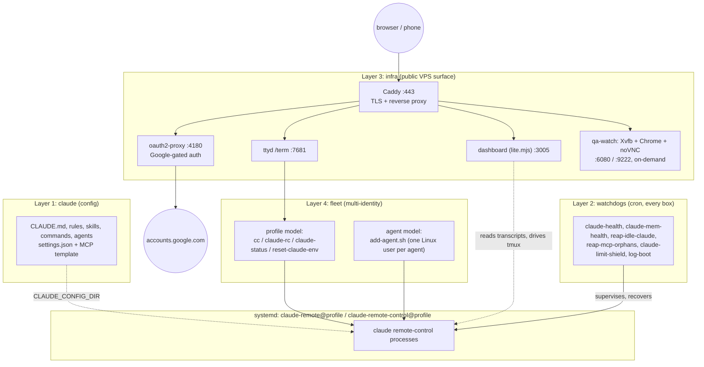

# mows-harness

A complete, self-hosted Claude Code harness: agentic config, watchdogs, a web cockpit, and
multi-identity fleet tooling. It ships as four independent layers — install only the ones
you need, from a single laptop up to a full public, phone-reachable VPS.

- **`claude/`** — the agentic config itself: `CLAUDE.md`, rules, skills, commands, agents,
  a `settings.json` template, and an MCP template. Works standalone as a Claude Code plugin
  too (see "The plugin route" below).
- **`watchdogs/`** — six cron scripts that keep a remote-control Claude Code process alive
  and clean: unit/wedge recovery, memory-capture verification, idle-session reaping,
  orphaned-MCP reaping, usage-limit auto-continue, a boot log.
- **`infra/`** — templates for the public web surface: Caddy (TLS + reverse proxy),
  oauth2-proxy (Google-gated auth), a zero-dependency session dashboard, a `ttyd` web
  terminal, and an on-demand browser-QA watch-stack. `install.sh` only ever *stages* these
  into `./rendered/` for review — it never installs, enables, or starts anything live.
- **`fleet/`** — tooling for running more than one Claude Code identity on the same box:
  either several named *profiles* under one admin account (`cc`, `claude-rc`,
  `claude-status`, `reset-claude-env`), or several separate Linux-user *agent* accounts
  (`add-agent.sh`).

Full technical detail — port map, the profile-vs-agent model, watchdog rationale, known
operational caveats — lives in [`docs/architecture.md`](docs/architecture.md). Third-party
attributions are in [`ATTRIBUTIONS.md`](ATTRIBUTIONS.md). The end-to-end VPS walkthrough is
in [`infra/SETUP.md`](infra/SETUP.md), which cross-references the per-module setup guides:
[`fleet/SETUP.md`](fleet/SETUP.md), [`watchdogs/SETUP.md`](watchdogs/SETUP.md),
[`infra/os/SETUP.md`](infra/os/SETUP.md), [`infra/qa-watch/SETUP.md`](infra/qa-watch/SETUP.md).

## Architecture



## Which layer do I need?

| You are... | Run | You get |
|---|---|---|
| On your own laptop, driving Claude Code yourself | `./install.sh --claude` | `CLAUDE.md`, rules, skills, commands, agents, `settings.json`, MCP template, plugin marketplaces registered |
| Running one unattended box you check in on (SSH / remote-control) | `./install.sh --claude --watchdogs` | + 6 cron watchdogs keeping a `claude-remote@` unit alive, reaping idle sessions/orphaned MCP processes, auto-continuing past usage-limit stalls |
| Standing up a full public VPS (phone-reachable dashboard, `/term`, Google-gated) | `./install.sh --all`, then work through [`infra/SETUP.md`](infra/SETUP.md) by hand | + every layer above, plus Caddy/oauth2-proxy/dashboard/ttyd/qa-watch templates staged into `./rendered/` for review — `install.sh` never installs, enables, or starts any of it itself |
| Running several Claude identities on one box | `./install.sh --fleet`, then `cc`/`claude-rc` (profiles) and/or `sudo fleet/add-agent.sh <name>` (agents) | + multi-identity CLIs — see [`fleet/SETUP.md`](fleet/SETUP.md) for the profile-vs-agent distinction before picking one |

## Quickstart

```bash
git clone https://github.com/alhe99/mows-harness.git
cd mows-harness

./install.sh --claude              # laptop: just the agentic config
./install.sh --claude --watchdogs  # unattended box: + cron health checks
./install.sh --all                 # full VPS: + infra staging + fleet CLIs
./install.sh --fleet               # multi-account: profile/agent tooling on top of any of the above
./install.sh                       # no flags, no --non-interactive: interactive picker
```

Each layer is independent and idempotent — re-run with a different flag set any time, or
combine several in one invocation (`--claude --watchdogs`). `--non-interactive` never
prompts: unset template variables (`{{DOMAIN}}`, `{{ADMIN_USER}}`, ...) are left as literal
placeholders in rendered output, with a `WARN:` line telling you which ones. See
`./install.sh --help` for the full flag list.

### The plugin route (skills/commands/agents only, no shell script)

If you just want the commands, agents, and skills — without cloning the repo or running
`install.sh` at all — add this repo as a plugin marketplace directly from GitHub, then
install the plugin, both from inside a running Claude Code session:

```
/plugin marketplace add alhe99/mows-harness
/plugin install mows-core@mows-harness
```

(`alhe99/mows-harness` is this repo's own GitHub `owner/repo`, matching
[`.claude-plugin/marketplace.json`](.claude-plugin/marketplace.json)'s marketplace name;
`mows-core` is the plugin name declared in
[`claude/.claude-plugin/plugin.json`](claude/.claude-plugin/plugin.json).)

This route does **not** give you the global `~/.claude/CLAUDE.md` memory file (it's
deliberately not part of the plugin's loaded content — see `docs/architecture.md`'s note on
why), the pre-built `settings.json`/MCP templates, or the watchdogs/infra/fleet layers. For
those, use `git clone` + `install.sh` above.

## Security defaults

**No `--dangerously-skip-permissions` alias, ever, by default.** Nothing this harness
installs makes Claude Code skip its own permission prompts. If you want that anyway, it's
an opt-in you add yourself, understanding what it removes:

```bash
# OPT-IN ONLY — this harness does not install this. Adding it means every tool call
# (Bash, Edit, Write, MCP calls...) runs with ZERO confirmation: no "may I run this
# command", no diff review before a Write/Edit lands, no guard against a prompt-injected
# instruction reaching a destructive command. Only add this on a box/account where you've
# already accepted that risk.
alias claude="claude --dangerously-skip-permissions"
```

**Scoped sudoers, never `NOPASSWD: ALL`.** Every sudo grant this harness ships
(`infra/os/sudoers.d/claude-harness.template`, `claude-harness-agent.template`) is a named,
anchored command list — `systemctl start|stop|restart|enable|disable` on exactly the
`claude-remote@*`/`claude-remote-control@*` unit families (plus `start`/`stop` on
`claude-qa-watch` and `reload` on `caddy`) — never a bare `ALL`, never an unanchored glob.
The admin template's own header comment walks through a concrete exploit: an unanchored
glob (`claude-remote@*` matched as a shell-style wildcard instead of an anchored regex)
would let one extra space-separated argument — e.g. an absolute path to an
attacker-placed unit file — ride along for free, handing out password-free root code
execution. Every pattern here is anchored `^...$` specifically to close that off. Full
rationale in [`docs/architecture.md`](docs/architecture.md); install steps in
[`infra/os/SETUP.md`](infra/os/SETUP.md).

## Requirements

- **Ubuntu 24.04** is the target and reference platform — the infra layer's setup docs were
  written and verified against it. `install.sh` itself only hard-guards on `apt-get` +
  `systemctl` being present, so other systemd-based Debian-family distros will likely work
  for `--claude`/`--watchdogs`/`--fleet`; `--infra` has had less cross-distro scrutiny.
- **Node.js — 20+ recommended, required for `chrome-devtools-mcp`.** Needs vary by piece:
  the dashboard (`infra/dashboard/lite.mjs`) runs fine on Node 18, but its systemd unit
  execs `/usr/bin/node` directly and runs as root by design (see "The dashboard runs as
  root, by design" in `docs/architecture.md`) — a root process never sources a per-user
  fnm/nvm shim, so whatever `/usr/bin/node` resolves to is what it gets. Of the two bundled
  MCP servers launched via `npx`, `@playwright/mcp` needs only `>=18`, but
  `chrome-devtools-mcp` needs `^20.19 || ^22.12 || >=23` (both confirmed against each
  package's own `engines` field) — so Node 20+ is the one version that covers everything
  this harness uses. Check `node -v`; if it's older than 20, don't reach for a plain
  `apt-get install nodejs` — Ubuntu 24.04's own package is 18.19.1, still too old for
  `chrome-devtools-mcp`. Install current Node from NodeSource instead: exact commands at
  [`infra/SETUP.md`](infra/SETUP.md) step 2, where the infra layer actually needs and runs
  them (nvm/fnm work too for your own shell — just make sure `/usr/bin/node` itself
  resolves to 20+ for the dashboard specifically).
- **tmux.** Every interactive Claude Code session this harness launches — `fleet/bin/cc`,
  the web terminal, remote-control's `--spawn same-dir` — runs inside a named tmux session,
  so closing a browser tab or losing an SSH connection never kills the underlying process.
- **systemd.** Remote-control units, the transcript-prune timer, the dashboard,
  oauth2-proxy, and the optional qa-watch stack are all systemd units; `install.sh` refuses
  to run at all without both `apt-get` and `systemctl` on `PATH`.

## Plugin split

`claude/settings.template.json` pre-registers three ecosystem marketplaces
(`extraKnownMarketplaces`) and pre-enables five plugins (`enabledPlugins`) — Claude Code
treats `enabledPlugins` entries as "should be active by default," so these five come up
active with no manual `/plugin install` once `settings.json` is in place and their
marketplace is known:

| Plugin | Marketplace registered by this repo? | Pre-enabled? |
|---|---|---|
| `mows-core@mows-harness` | — (this repo's own local checkout; `marketplace add "$PWD"`) | No — install yourself (see "The plugin route" above) |
| `superpowers@claude-plugins-official`, `code-review@claude-plugins-official`, `security-guidance@claude-plugins-official`, `skill-creator@claude-plugins-official` | built into the CLI already | **Yes** |
| `claude-mem@thedotmack` | Yes | **Yes** |
| `ponytail@ponytail` | Yes | No — optional, install yourself: `/plugin install ponytail@ponytail` |
| `andrej-karpathy-skills@karpathy-skills` | Yes | No — optional: `/plugin install andrej-karpathy-skills@karpathy-skills` |
| `figma@claude-plugins-official` | No — not referenced by this repo at all | No — optional: `/plugin install figma@claude-plugins-official` (its marketplace is the built-in one, so no `marketplace add` needed) |

`mows-core` needs its own manual install because its marketplace source is a local
checkout path, not a portable GitHub reference a template can bake in — see the header
comment in `install.sh`'s `layer_claude()` for the full reasoning.

## Credits

Extracted from the "mows" reference deployment.

This repo itself is MIT-licensed (see [`LICENSE`](LICENSE)). Third-party skills, upstream
infra projects, and their licenses are catalogued in [`ATTRIBUTIONS.md`](ATTRIBUTIONS.md).
